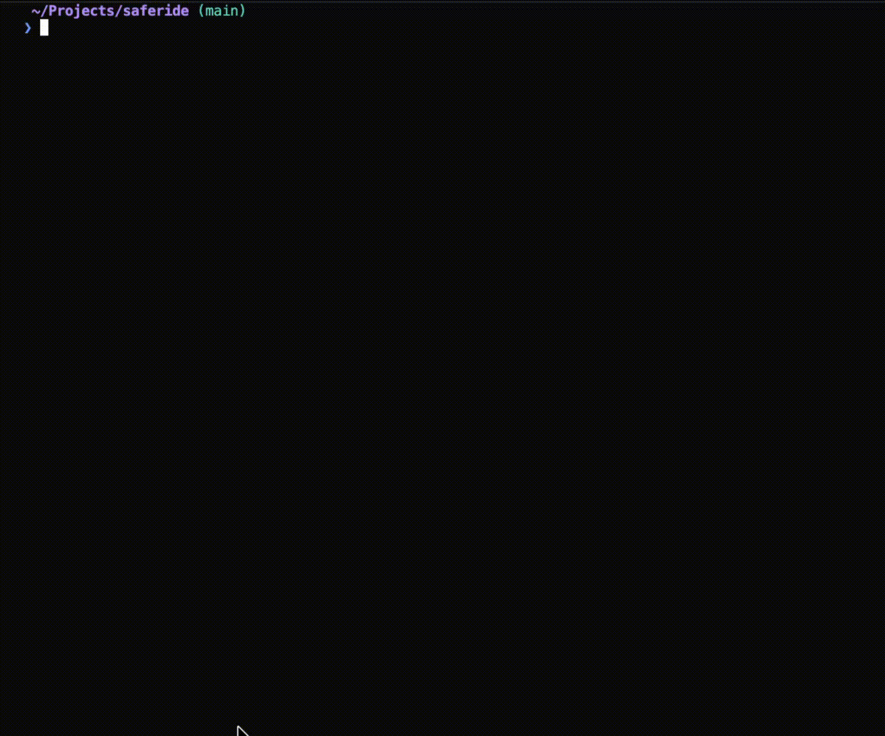

<h1 align="center">
  Sync Contribution Graph
</h1>


## Technologies Used 🛠️

This project uses several key technologies to scrape GitHub contribution data and generate backdated commits:

| Technology | Purpose | Why It's Used |
|------------|---------|---------------|
| **Node.js** | Runtime environment | Provides a JavaScript runtime for executing the scraping and git command generation |
| **Playwright** | Browser automation | Scrapes GitHub contribution graphs by launching a headless browser to access the rendered contribution calendar data |
| **Inquirer** | Interactive CLI prompts | Creates a user-friendly terminal interface for gathering configuration (username, year, batch settings, etc.) |
| **Axios** | HTTP client | Validates GitHub usernames by making API calls to ensure the target account exists |
| **ShellJS** | Shell command execution | Executes generated bash scripts and git commands directly from Node.js |
| **node-html-parser** | HTML parsing | Parses the scraped GitHub page HTML to extract contribution data from the calendar elements |

### How the Script Generation Works

The utility scrapes contribution data from a specified GitHub account and generates a bash script named by year (e.g., `2024.sh`, `2023.sh`). This script contains git commands that:
1. Create backdated commits with timestamps matching the original contributions
2. Modify the `contributions.txt` file for each commit (to create actual file changes)
4. Automatically detect your system timezone and handle DST appropriately for accurate date mapping
5. Include idempotency checks to prevent duplicate commits if run multiple times

When executed (e.g., `sh ./2023.sh`), the generated script applies all the backdated commits to your repository and pushes them to GitHub, which then updates your contribution graph to reflect the imported contributions.

<div align="center">
  <a href="img/demo.gif">
    
  </a>
</div>


## How to Use 🚀

1. [Use this repo as a template](https://github.com/jcrawford/saferide/generate) to create a new repo in your personal account, and provide a name.
2. Clone your new repo locally.  `cd` into the newly created directory.
3. It requires NodeJS and `npm` (or `yarn`) to be installed on your machine. Run `npm i` or `yarn install` in your terminal.
4. Use `npm start` or `yarn start` in order to trigger a series of terminal prompts that will help with configuration.


If you change your mind about these commits later, you can delete the repository and they'll disappear from your contribution graph. In my case, I used this to sync comits 2022-2025 from my Saferide Health account [here](https://github.com/josephcrawfordSRH?tab=overview). 

You can see the syncd contributions [here](https://github.com/jcrawford?tab=overview)


## Requested Information 🌳

| Key        | Description                                                                                                                                                 | Example                                              |
| ---------- | ----------------------------------------------------------------------------------------------------------------------------------------------------------- | ---------------------------------------------------- |
| `username` | The username whose graph contributions you'd like to copy.                                                                                                  | josephcrawfordSRH                                    |
| `author`   | The name of the author for your personal account                                                                                                            | jcrawford                                            |
| `email`    | The email for your personal account                                                                                                                         |                                                      |
| `year`     | Year that you would like to sync with provided `username`. Currently doesn't support multiple years.                                                        | Current year                                         |
| `batched`  | Whether or not to batch imports (you should)                                                                                                                | Y                                                    |
| `size`     | How many contributions per batch?                                                                                                                           | 500                                                  |
| `execute`  | Let's the code know whether to simply generate `[year].sh` that, when executed, will force push commits to `main`. Or to both generate and execute at once. | `false`, in other words generate _without_ execution |
| `confirm`  | A quick double check that you're ready to proceed.                                                                                                          | Y                                                    |


## How It Works 🔧

The utility generates a year-named bash script (e.g., `2024.sh`) that creates a single commit for every contribution in the source account. For example, if a particular day has 2 contributions, the generated script will:

1. Add 2 lines to the `contributions.txt` file
2. Create 2 separate git commits
3. Backdate those commits to match the exact day they were completed in the source account

When you execute the generated script (`sh ./2024.sh`), it applies all commits to your repository and pushes them to GitHub, updating your contribution graph.

### The Contributions File

The `contributions.txt` file serves as the tracked file for all generated commits. Each commit adds a timestamped line to this file. The file only contains simple text entries like the following:
```
GitHub Contributions History
2022-02-21 12:00:00 - Contribution #1
2022-02-21 12:00:01 - Contribution #2
2022-03-03 12:00:00 - Contribution #1
2022-03-03 12:00:01 - Contribution #2
2022-03-03 12:00:02 - Contribution #3
2022-03-04 12:00:00 - Contribution #1
2022-03-04 12:00:01 - Contribution #2
2022-03-07 12:00:00 - Contribution #1
2022-03-07 12:00:01 - Contribution #2
2022-03-07 12:00:02 - Contribution #3
2022-03-07 12:00:03 - Contribution #4
2022-03-07 12:00:04 - Contribution #5
2022-03-07 12:00:05 - Contribution #6
2022-03-07 12:00:06 - Contribution #7
2022-03-07 12:00:07 - Contribution #8
2022-03-07 12:00:08 - Contribution #9
2022-03-08 12:00:00 - Contribution #1
2022-03-08 12:00:01 - Contribution #2
2022-03-08 12:00:02 - Contribution #3
2022-03-08 12:00:03 - Contribution #4
2022-03-08 12:00:04 - Contribution #5
2022-03-08 12:00:05 - Contribution #6
2022-03-08 12:00:06 - Contribution #7
2022-03-08 12:00:07 - Contribution #8
```

As you can see, **no confidential or personal data is included** in these commits. The generated script creates commits with only timestamps - all you need for GitHub to register the contribution on your graph is a commit made on the same day with the correct date metadata.

## Questions & Feedback
Feel free to reach out to me with any question/feedback, create issues in this repo if you encounter any issues executing this process.
